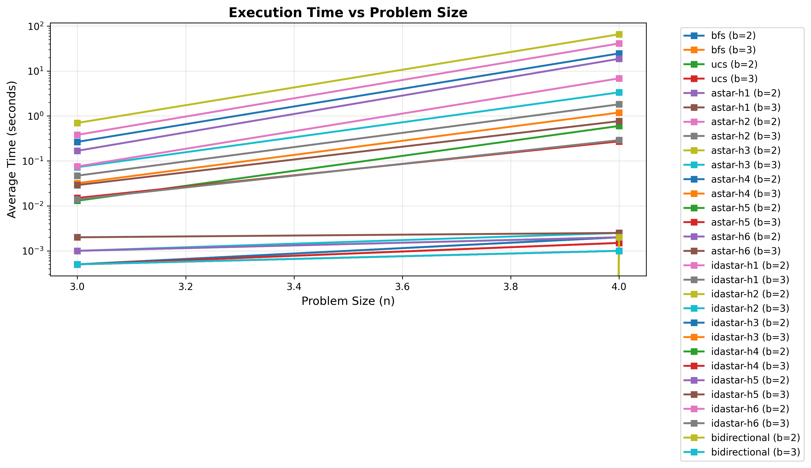

# Missionaries and Cannibals Problem Solver

**CSCI 5511 - Artificial Intelligence I - Final Project**

**Team:**
- Hema Poojitha Chandu (chand968@umn.edu)
- Reshma Rao Chandukudlu Hosamane (chand950@umn.edu)

## Overview

This project implements and compares multiple search algorithms (BFS, UCS, A*, IDA*, Bidirectional BFS) on the generalized Missionaries and Cannibals river-crossing puzzle. 

The implementation supports:

- **2-group variant**: Standard (n missionaries, n cannibals)
- **3-group variant**: Extended with soldiers (n missionaries, n cannibals, s soldiers)
- **Multiple heuristics**: h1 (people-per-boat), h2 (dominant-group), h3 (boat-parity), h4 (formula based), h5 (tight lower bound), h6(Pattern db)

## Features

**Visual Solution Display**
- Step-by-step visualization showing people on each bank
- Clear action descriptions (e.g., "Move 2M, 1C from L to R")
- Boat position indicator

**Four Search Algorithms**
- **BFS**: Breadth-First Search (optimal for unit costs)
- **UCS**: Uniform-Cost Search (optimal for varying costs)
- **A***: Informed search with heuristics
- **IDA***: Memory-efficient iterative deepening

**Comprehensive Analysis**
- Automated experiment runner
- Performance metrics (time, nodes expanded, solution length)
- Comparison plots and tables
- LaTeX-ready results

## Quick Start

Run to see BFS solve the classic 3M3C problem 
```bash
python src/demo.py
```
## Single Algorithm Execution 
Run a specific algorithm on custom problem size:
(a). BFS on 3 Missionaries , 3 Cannibals , boat capacity 2     
```bash 
python src/main.py -n 3 -b 2 -a bfs
```
(b). A * with optimal heuristic on larger problem     
```bash
python src/main.py -n 5 -b 3 -a astar -H h6
```
(c). With soldiers (3 group variant)     
```bash
python src/main.py -n 3 -b 2 -s 2 -a astar -H h6
```
## Command-line arguments:
 -n: Number of missionaries and cannibals
 -b: Boat capacity 
 -s: Number of soldiers for 3-group variant 
 -a: Algorithm choice: [bfs, ucs, astar, idastar, bidirectional]
 -H: Heuristic for A*/IDA*: h1- h6


### Compare All Algorithms

```bash
# Compare all algorithms on the same instance
python src/main.py -n 3 -b 2 --compare

# Compare all heuristics with A*
python src/main.py -n 4 -b 3 --compare-heuristics
```

### Run Full Experiments

```bash
# Run systematic experiments across problem sizes
python run_experiments.py

# Generate plots and tables
python analyze_results.py

```
See `data/` directory for detailed performance data and visualizations.

### Scalability: Time vs Problem Size


**The log-scale graph reveals three performance tiers**: A* with strong heuristics (h4-h6) and Bidirectional BFS maintain sub-0.01s execution across all problem sizes, while IDA* with weak heuristics (h1-h3) suffers exponential growth (0.001s → 50s from n=3 to n=4). This demonstrates that heuristic quality creates **orders of magnitude** performance difference for memory-efficient algorithms like IDA*.